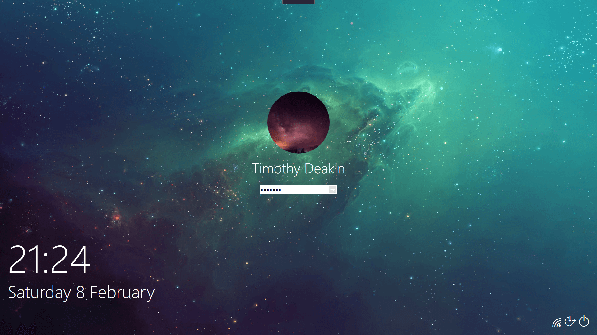

<h1 align="center">
   
  
   
SharpLocker
   
</h1>

<h4 align="center">SharpLocker helps get current user credentials by popping a fake Windows lock screen.</h4>

  <a href="#key-features">Key Features</a> •
  <a href="#how-to-use">How To Use</a> •
  <a href="#download">Download</a> •
  <a href="#acknowledgements">Acknowledgements</a> •
  <a href="#license">License</a>

## Key Features

* Obtains the user's profile image. (Anti-aliased)
* Obtains the user's current lockscreen (Including Spotlight Images)

## Roadmap
To see the future features, see [Projects](https://github.com/cftad/SharpLocker/projects).

## Current State

At the moment there are two separate applications, the legacy winforms app, and the rebuild WPF. [Fody](https://github.com/Fody/Fody) and [Costura](https://github.com/Fody/Costura) are used to embed `Sharplocker.Core` as part of the main executables.

* **SharpLocker (WIP)** - The new WPF app, created to enable more control over the styling to better emulate the lockscreen.

* **SharpLocker-Winforms** - Current Application soon to be re-written in WPF.

***SharpLocker.Core*** is used for shared logic which can be used by both the WPF and Winforms apps.

## How To Use

## Download

You can [download](/releases) the latest version.

## Acknowledgements

This application is based on the original winforms app by [@Pickfordmatt](https://github.com/Pickfordmatt/SharpLocker)

## Support

## License
